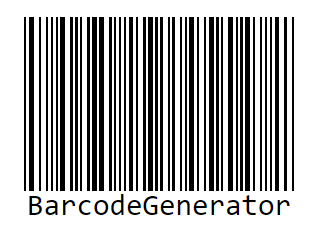
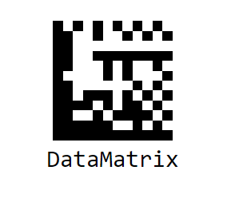

# Getting Started with Syncfusion Barcode Component in Vue 3

This section explains how to use Barcode component in Vue 3 application.

## Prerequisites

[System requirements for Syncfusion Vue UI components](https://ej2.syncfusion.com/vue/documentation/system-requirements/)

## Creating Vue application using Vue CLI

The easiest way to create a Vue application is to use the [`Vue CLI`](https://github.com/vuejs/vue-cli). Vue CLI versions higher than [`4.5.0`](https://v3.vuejs.org/guide/migration/introduction.html#vue-cli) are mandatory for creating applications using Vue 3. Use the following command to uninstall older versions of the Vue CLI.

```bash
npm uninstall vue-cli -g
```

Use the following commands to install the latest version of Vue CLI.

```bash
npm install -g @vue/cli
npm install -g @vue/cli-init
```

Create a new project using the following command.

```bash
vue create quickstart

```

Initiating a new project prompts us to select the type of project to be used for the current application. Select the option `Default (Vue 3)` from the menu.


## Adding Syncfusion Barcode package in the application

Syncfusion Vue packages are maintained in the [`npmjs.com`](https://www.npmjs.com/~syncfusionorg) registry.
In this example, the Barcode component will be used. Use the following command to install it.

```bash
npm install @syncfusion/ej2-vue-barcode-generator
```

## Adding CSS reference for Syncfusion Vue Barcode component

Import the necessary css styles for the Barcode component along with dependency styles in the `<style>` section of the `src/App.vue` file as follows.

```
<style>
  @import "../node_modules/@syncfusion/ej2-base/styles/material.css";
  @import "../node_modules/@syncfusion/ej2-icons/styles/material.css";
  @import "../node_modules/@syncfusion/ej2-vue-barcode-generator/styles/material.css";
</style>
```

## Adding Syncfusion Vue Barcode component in the application

You have completed all of the necessary configurations required to render the Syncfusion Vue component. Now, you are going to add the Barcode component using the following steps:

1. Import the Barcode component in the `<script>` section of the `src/App.vue` file.

    ```
      <script>
        import { BarcodeGeneratorComponent, QRCodeGeneratorComponent, DataMatrixGeneratorComponent } from '@syncfusion/ej2-vue-barcode-generator';
      </script>
    ```

2. Register the Barcode component, which is used in this example. The following table contains a list of directives and the tag names that can be used in the Barcode component.

    | Directive Name   | Tag Name    |
    |------------------|-------------|
    | `BarcodeGeneratorComponent` | `ejs-barcodegenerator` |
    | `QRCodeGeneratorComponent` | `ejs-qrcodegenerator` |
    | `DataMatrixGeneratorComponent` | `ejs-datamatrixgenerator` |

3. By using the following code sample, you can add the component definition in template section.

    ```

    <template>
      <div id="app" class="barcodeStyle">
        <ejs-barcodegenerator
          id="barcode"
          ref="barcodeControl"
          :width="width"
          :height="height"
          :type="type"
          :value="value"
          :mode="mode"
          :displayText="displaytext"
        >
        </ejs-barcodegenerator>
      </div>
    </template>
    ```

4. Declare the barcode generator properties in the `script` section. Here, declare the width, Height, type, value, and mode values for the `ejs-barcodegenerator` property.

    ```js
    data() {
      return {
        width: "200px",
        height: "150px",
        type: "Codabar",
        value: "123456789",
        mode: "SVG",
        displaytext: { text: 'BarcodeGenerator'}
        };
    }
      ```

5. Summarizing the above steps, update the `src/App.vue` file with following code.

    ```

    <template>
      <div id="app" class="barcodeStyle">
        <ejs-barcodegenerator
          id="barcode"
          ref="barcodeControl"
          :width="width"
          :height="height"
          :type="type"
          :displayText="displaytext"
          :value="value"
          :mode="mode"
        >
        </ejs-barcodegenerator>
      </div>
    </template>

    <script>
    import {
      BarcodeGeneratorComponent,
    } from "@syncfusion/ej2-vue-barcode-generator";

    import "../node_modules/@syncfusion/ej2-base/styles/material.css";
    import "../node_modules/@syncfusion/ej2-icons/styles/material.css";
    import "../node_modules/@syncfusion/ej2-vue-barcode-generator/styles/material.css";

    export default {
      name: "App",
      components: {
        "ejs-barcodegenerator": BarcodeGeneratorComponent,
      },
      data() {
        return {
          width: "200px",
            height: "150px",
            type: "Codabar",
            value: "123456789",
            mode: "SVG",
            displaytext: { text: 'BarcodeGenerator'},
        };
      },
    };
    </script>

    <style>
      @import "../node_modules/@syncfusion/ej2-base/styles/material.css";
      @import "../node_modules/@syncfusion/ej2-icons/styles/material.css";
      @import "../node_modules/@syncfusion/ej2-vue-barcode-generator/styles/material.css";
    </style>
    ```

## Running the application

Run the application using the following command.

```bash
npm run serve
```

Web server will be initiated, open the quick start app in the browser at port `localhost:8080`.



## Adding Syncfusion Vue QR Generator control in the application

You can add the QR code generator component by using the following code sample.

```
<template>
  <div id="app" class="barcodeStyle">
    <ejs-qrcodegenerator
      id="qrcode"
      ref="qrcodeControl"
      :width="width"
      :height="height"
      :type="type"
      :displayText="displaytext"
      :value="value"
      :mode="mode"
    >
    </ejs-qrcodegenerator>
  </div>
</template>

<script>

import {
  QRCodeGeneratorComponent,
} from "@syncfusion/ej2-vue-barcode-generator";

import "../node_modules/@syncfusion/ej2-base/styles/material.css";
import "../node_modules/@syncfusion/ej2-icons/styles/material.css";
import "../node_modules/@syncfusion/ej2-vue-barcode-generator/styles/material.css";

export default {
  name: "App",
  components: {
    "ejs-qrcodegenerator": QRCodeGeneratorComponent,
  },
  data() {
    return {
      width: "200px",
        height: "150px",
        type: "Codabar",
        value: "123456789",
        mode: "SVG",
        displaytext: { text: 'QRcodeGenerator' },
    };
  },
};
</script>

<style>
  @import "../node_modules/@syncfusion/ej2-base/styles/material.css";
  @import "../node_modules/@syncfusion/ej2-icons/styles/material.css";
  @import "../node_modules/@syncfusion/ej2-vue-barcode-generator/styles/material.css";
</style>

```


## Adding Syncfusion Vue Datamatrix Generator control in the application

You can add the datamatrix code generator component by using the following code sample.

```
<template>
  <div id="app" class="barcodeStyle">
    <ejs-datamatrixgenerator
      id="qrcode"
      ref="qrcodeControl"
      :width="width"
      :height="height"
      :type="type"
      :displayText="displaytext"
      :value="value"
      :mode="mode"
    >
    </ejs-datamatrixgenerator>
  </div>
</template>

<script>

import {
  DataMatrixGeneratorComponent,
} from "@syncfusion/ej2-vue-barcode-generator";

import "../node_modules/@syncfusion/ej2-base/styles/material.css";
import "../node_modules/@syncfusion/ej2-icons/styles/material.css";
import "../node_modules/@syncfusion/ej2-vue-barcode-generator/styles/material.css";

export default {
  name: "App",
  components: {
    "ejs-datamatrixgenerator": DataMatrixGeneratorComponent,
  },
  data() {
    return {
      width: "200px",
        height: "150px",
        type: "Codabar",
        value: "123456789",
        mode: "SVG",
        displaytext: { text: 'DataMatrix' },
    };
  },
};
</script>

<style>
  @import "../node_modules/@syncfusion/ej2-base/styles/material.css";
  @import "../node_modules/@syncfusion/ej2-icons/styles/material.css";
  @import "../node_modules/@syncfusion/ej2-vue-barcode-generator/styles/material.css";
</style>

```



Refer the following sample, [vue3-barcode-generator-getting-started](https://github.com/SyncfusionExamples/vue3-barcode-getting-started).
