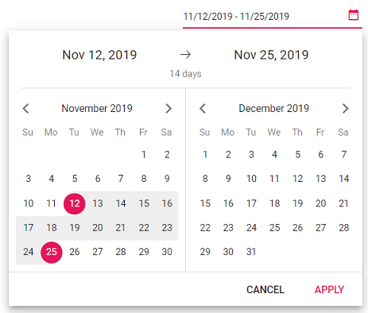

# Getting Started

This section explains how to use Syncfusion Vue DateRangePicker components in Vue 3 application.

To get start quickly with Vue DateRangePicker, you can check on this video:



## Prerequisites

[System requirements for Syncfusion Vue UI components](https://ej2.syncfusion.com/vue/documentation/system-requirements/)

## Creating Vue application using Vue CLI

The easiest way to create a Vue application is to use the [`Vue CLI`](https://github.com/vuejs/vue-cli). Vue CLI versions above [`4.5.0`](https://v3.vuejs.org/guide/migration/introduction.html#vue-cli) are mandatory for creating applications using Vue 3. Use the following command to uninstall older versions of the Vue CLI.

```bash
npm uninstall vue-cli -g
```

Use the following commands to install the latest version of Vue CLI.

```bash
npm install -g @vue/cli
npm install -g @vue/cli-init
```

Create a new project using the command below.

```bash
vue create quickstart
```

Initiating a new project prompts us to choose the type of project to be used for the current application. Select the option `Default (Vue 3)` from the menu.


## Adding Syncfusion DateRangePicker package in the application

 Syncfusion Vue packages are maintained in the [`npmjs.com`](https://www.npmjs.com/~syncfusionorg) registry. The DateRangePicker component will be used in this example. To install it use the following command.

```bash
npm install @syncfusion/ej2-vue-calendars --save
```

## Adding CSS reference for Syncfusion Vue DateRangePicker component

Import the needed css styles for the DateRangePicker component along with dependency styles in the `<style>` section of the `src/App.vue` file as follows.

```
<style>
    @import '../node_modules/@syncfusion/ej2-base/styles/material.css';
    @import '../node_modules/@syncfusion/ej2-buttons/styles/material.css';
    @import '../node_modules/@syncfusion/ej2-inputs/styles/material.css';
    @import '../node_modules/@syncfusion/ej2-popups/styles/material.css';
    @import '../node_modules/@syncfusion/ej2-lists/styles/material.css';
    @import "../node_modules/@syncfusion/ej2-vue-calendars/styles/material.css";
</style>
```

## Adding Syncfusion Vue DateRangePicker component in the application

You have completed all the necessary configurations needed for rendering the Syncfusion Vue component. Now, you are going to add the DateRangePicker component using following steps.

Import the DateRangePicker component in the `<script>` section of the `src/App.vue` file.

```
<script>
import { DateRangePickerComponent } from "@syncfusion/ej2-vue-calendars";
</script>
```

Register the DateRangePicker component.

 ```js
import { DateRangePickerComponent } from "@syncfusion/ej2-vue-calendars";
//Component registeration
export default {
    name: "App",
    components: {
        'ejs-daterangepicker' : DateRangePickerComponent,
    }
}
```

Add the component definition in template section.

```
<template>
    <div class="control_wrapper">
        <ejs-daterangepicker></ejs-daterangepicker>
    </div>
</template>
```

Summarizing the above steps, update the `src/App.vue` file with following code.

```
<template>
    <div class="control_wrapper">
        <ejs-daterangepicker></ejs-daterangepicker>
    </div>
</template>
<script>
import { DateRangePickerComponent } from "@syncfusion/ej2-vue-calendars";
//Component registeration
export default {
    name: 'App',
    components: {
        "ejs-daterangepicker": DateRangePickerComponent
    },
}
</script>
<style>
    @import '../node_modules/@syncfusion/ej2-base/styles/material.css';
    @import '../node_modules/@syncfusion/ej2-buttons/styles/material.css';
    @import '../node_modules/@syncfusion/ej2-inputs/styles/material.css';
    @import '../node_modules/@syncfusion/ej2-popups/styles/material.css';
    @import '../node_modules/@syncfusion/ej2-lists/styles/material.css';
    @import "../node_modules/@syncfusion/ej2-vue-calendars/styles/material.css";
    .control_wrapper {
        max-width: 250px;
        margin: 0 auto;
    }
</style>
```

## Running the application

Run the application using the following command.

```bash
npm run serve
```

Output be like the below.


## Setting the start date and end date

The start and end date in a range can be defined with the help of startDate and endDate property. The following example demonstrates to set the start and end date on initializing the DateRangePicker. To know more about range restriction in DateRangePicker, please refer this [page](./range-restriction).

```
<template>
  <div id="app">
    <div class='wrapper'>
      <ejs-daterangepicker :startDate="startVal" :endDate="endVal" :placeholder="waterMark"></ejs-daterangepicker>
    </div>
  </div>
</template>
<script>
import { DateRangePickerComponent } from "@syncfusion/ej2-vue-calendars";
//Component registeration
export default {
    name: 'App',
    components: {
        "ejs-daterangepicker": DateRangePickerComponent
    },
    data () {
        return {
            startVal : new Date("11/12/2019 12:00 PM"),
            endVal : new Date("11/25/2019 5:00 PM"),
            waterMark : 'Select a Range'
        }
    }
}
</script>
<style>
@import '../node_modules/@syncfusion/ej2-base/styles/material.css';
@import '../node_modules/@syncfusion/ej2-buttons/styles/material.css';
@import '../node_modules/@syncfusion/ej2-inputs/styles/material.css';
@import '../node_modules/@syncfusion/ej2-popups/styles/material.css';
@import '../node_modules/@syncfusion/ej2-lists/styles/material.css';
@import "../node_modules/@syncfusion/ej2-vue-calendars/styles/material.css";
 .wrapper {
    max-width: 250px;
    margin: 0 auto;
  }
</style>
```

Output be like the below.



## See Also

* [Render DateRangePicker with pre-defined ranges](./customization#preset-ranges)
* [Render DateRangePicker with specific culture](./globalization)