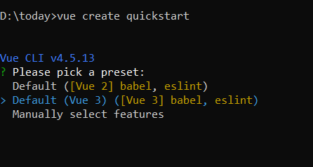

# Getting Started

This section explains how to use Syncfusion Vue Dialog component in Vue 3 application.

## Prerequisites

[System requirements for Syncfusion Vue UI components](https://ej2.syncfusion.com/vue/documentation/system-requirements/)

## Creating Vue application using Vue CLI

The easiest way to create a Vue application is to use the [`Vue CLI`](https://github.com/vuejs/vue-cli). Vue CLI versions above [`4.5.0`](https://v3.vuejs.org/guide/migration/introduction.html#vue-cli) are mandatory for creating applications using Vue 3. Use the following command to uninstall older versions of the Vue CLI.

```bash
npm uninstall vue-cli -g
```

Use the following commands to install the latest version of Vue CLI.

```bash
npm install -g @vue/cli
npm install -g @vue/cli-init
```

Create a new project using the command below.

```bash
vue create quickstart
cd quickstart

```

Initiating a new project prompts us to choose the type of project to be used for the current application. Select the option `Default (Vue 3)` from the menu.



## Adding Syncfusion Dialog package in the application

All the available Essential JS 2 packages are published in [`npmjs.com`](https://www.npmjs.com/~syncfusionorg) registry.

Install the `Dialog` component by using the below npm command.

```bash
npm install @syncfusion/ej2-vue-popups --save
```

## Adding CSS reference for Syncfusion Vue3 Dialog component

Import the needed css styles for the Dialog component along with dependency styles in the `<style>` section of the `src/App.vue` file as follows.

```
<style>
  @import "../node_modules/@syncfusion/ej2-base/styles/material.css";
  @import "../node_modules/@syncfusion/ej2-vue-buttons/styles/material.css";
  @import "../node_modules/@syncfusion/ej2-vue-popups/styles/material.css";
</style>
```

## Adding Syncfusion Vue3 Dialog component in the application

You have completed all the necessary configurations needed for rendering the Syncfusion Vue component. Now, you are going to add the Dialog component using following steps.

* Import the Dialog component in the `<script>` section of the `src/App.vue` file.

     ```
     <script>
        import { DialogComponent } from "@syncfusion/ej2-vue-popups";
      </script>
     ```

* Register the Dialog component.

```javascript
        import { DialogComponent } from "@syncfusion/ej2-vue-popups";
        //Component registeration
        export default {
            name: "App",
            components: {
                "ejs-dialog": DialogComponent,
            }
        }
```

* Add the component definition in template section.

```
    <template>
    <div>
        <div id="target" class="control-section">
        <ejs-dialog :target="target" :width="width" :content="content">
        </ejs-dialog>
        </div>
    </div>
    </template>
```

* Summarizing the above steps, update the `src/App.vue` file with following code.

    ```
    <template>
      <div>
        <div id="target" class="control-section">
          <ejs-dialog :target="target" :width="width" :content="content">
          </ejs-dialog>
        </div>
      </div>
    </template>
    <script>
    import { DialogComponent } from "@syncfusion/ej2-vue-popups";

    export default {
      name: "App",
      components: {
        "ejs-dialog": DialogComponent,
      },
      data: function () {
        return {
          target: "#target",
          width: "335px",
          content: "This is a Dialog with content.",
        };
      },
      methods: {},
    };
    </script>
    <style>
    @import "../node_modules/@syncfusion/ej2-vue-popups/styles/material.css";
    .control-section {
      height: 100%;
      min-height: 200px;
    }
    </style>
    ```

## Running the application

Run the application using the following command.

```bash

npm run serve

```

Web server will be initiated, Open the quick start app in the browser at port `localhost:8080`.


> You can refer to our [Vue dialog](https://www.syncfusion.com/vue-components/vue-modal-dialog) feature tour page for its groundbreaking feature representations. You can also explore our [Vue dialog example](https://ej2.syncfusion.com/vue/documentation/dialog/getting-started/) that shows you how to render the dialog in Vue.