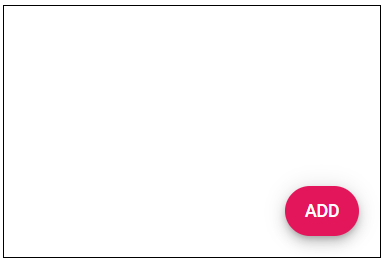
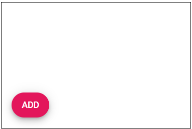

# Getting Started with Syncfusion Floating Action Button Component in Vue 3

This section explains how to create a simple Floating Action Button and demonstrate the basic usage of the Floating Action Button component in an Vue 3 environment.

## Prerequisites

[System requirements for Syncfusion Vue UI components](https://ej2.syncfusion.com/vue/documentation/system-requirements/)

## Creating Vue Application using Vue CLI

The easiest way to create a Vue application is to use the [`Vue CLI`](https://github.com/vuejs/vue-cli). Vue CLI versions above [`4.5.0`](https://v3.vuejs.org/guide/migration/introduction.html#vue-cli) are mandatory for creating applications using Vue 3. Use the following command to uninstall older versions of the Vue CLI.

```bash
npm uninstall vue-cli -g
```

Use the following commands to install the latest version of Vue CLI.

```bash
npm install -g @vue/cli
npm install -g @vue/cli-init
```

Create a new project using the command below.

```bash
vue create quickstart
cd quickstart
```

Initiating a new project prompts us to choose the type of project to be used for the current application. Select the option `Default (Vue 3)` from the menu.


## Adding Syncfusion Floating Action Button Package in the Application

Syncfusion Vue packages are maintained in the [`npmjs.com`](https://www.npmjs.com/~syncfusionorg) registry. The Floating Action Button component will be used in this example. To install it use the following command.

```bash
npm install @syncfusion/ej2-vue-buttons --save
```

## Adding CSS reference for Syncfusion Vue Floating Action Button Component

Import the needed css styles for the Button component along with dependency styles in the `<style>` section of the `src/App.vue` file as follows.

```
<style>
@import "../node_modules/@syncfusion/ej2-base/styles/material.css";
@import "../node_modules/@syncfusion/ej2-vue-buttons/styles/material.css";
</style>
```

## Adding Syncfusion Vue Floating Action Button Component in the Application

You have completed all the necessary configurations needed  for rendering the Syncfusion Vue component. Now, you are going to add the Floating Action Button component using following steps.

1. Import the Floating Action Button component in the `<script>` section of the `src/App.vue` file.

    ```
      <script>
      import { FabComponent } from "@syncfusion/ej2-vue-buttons";
      </script>
    ```

2. Register the Floating Action Button component which is used in this example.
  
    ```js
        import { FabComponent } from "@syncfusion/ej2-vue-buttons";

        export default {
            name: "App",
            components: {
            "ejs-fab": FabComponent
            }
        }
    ```

3. Add the component definition in template section.

    ```
    <template>
        <ejs-fab content='Add'></ejs-fab>
    </template>
    ```

4. Summarizing the above steps, update the `src/App.vue` file with following code.

    ```
    <template>
        <div id="targetElement" style="position:relative;min-height:350px;border:1px solid;">
            <ejs-fab id='fab' content='Add' target='#targetElement'></ejs-fab>
        </div>
    </template>

    <script>
    import { FabComponent } from "@syncfusion/ej2-vue-buttons";

    export default {
        name: "App",
        components: {
          "ejs-fab": FabComponent
        }
    }
    </script>

    <style>
    @import "../node_modules/@syncfusion/ej2-base/styles/material.css";
    @import "../node_modules/@syncfusion/ej2-vue-buttons/styles/material.css";
    </style>
    ```


## Positioning

The floating action button can be positioned using the [`position`](https://ej2.syncfusion.com/vue/documentation/api/floating-action-button#position) property. The floating action button is positioned based on the [`target`](https://ej2.syncfusion.com/vue/documentation/api/floating-action-button#target), if target is defined else positioned based on the browser viewport. The position values are TopLeft, TopCenter, TopRight, MiddleLeft, MiddleCenter, MiddleRight, BottomLeft, BottomCenter and BottomRight.

```
<template>
    <div id="targetElement" style="position:relative;min-height:350px;border:1px solid;">
        <ejs-fab id='fab' content='Add' position='BottomLeft' target='#targetElement'></ejs-fab>
    </div>
</template>

<script>
import { FabComponent } from "@syncfusion/ej2-vue-buttons";

export default {
    name: "App",
    components: {
        "ejs-fab": FabComponent
    }
}
</script>
<style>
@import "../node_modules/@syncfusion/ej2-base/styles/material.css";
@import "../node_modules/@syncfusion/ej2-vue-buttons/styles/material.css";
</style>
```



## Running the application

Run the application using the following command.

```bash
npm run serve
```

Web server will be initiated, Open the quick start app in the browser at port `localhost:8080`.