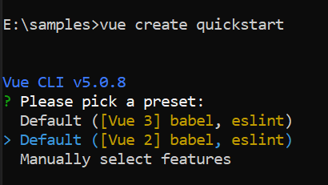

# Getting Started with the Vue Message Component in Vue 2

This article provides a step-by-step guide for setting up a Vue 2 project using [Vue-CLI](https://cli.vuejs.org/) and integrating the Syncfusion Vue Message component.

## Prerequisites

[System requirements for Syncfusion Vue UI components](https://ej2.syncfusion.com/vue/documentation/system-requirements/)

## Set up the Vue 2 project

One of the methods for generating a Vue 2 project using Vue-CLI is by utilizing the [vue create](https://cli.vuejs.org/#getting-started) command. To install Vue CLI, use one of the commands that are specific to either NPM or Yarn.

```bash
npm install -g @vue/cli
vue create quickstart
cd quickstart
npm run serve
```

or

```bash
yarn global add @vue/cli
vue create quickstart
cd quickstart
yarn run serve
```

Initiating a new project prompts us to choose the type of project to be used for the current application. Select the option `Default ([Vue 2] babel, eslint)` from the menu.



Now that `quickstart` is ready to run with default settings, let's add Syncfusion components to the project.

## Add Syncfusion Vue packages

Syncfusion Vue component packages are available at [npmjs.com](https://www.npmjs.com/search?q=ej2-vue). To use Syncfusion Vue components in the project, install the corresponding npm package.

This article uses the [Vue Message component](https://www.syncfusion.com/vue-components/vue-message) as an example. To use the Vue Message component in the project, the `@syncfusion/ej2-vue-notifications` package needs to be installed using the following command:

```bash
npm install @syncfusion/ej2-vue-notifications --save
```
or

```bash
yarn add @syncfusion/ej2-vue-notifications
```

## Import Syncfusion CSS styles

You can import themes for the Syncfusion Vue component in various ways, such as using CSS or SASS styles from npm packages, CDN, [CRG](https://ej2.syncfusion.com/javascript/documentation/common/custom-resource-generator/) and [Theme Studio](https://ej2.syncfusion.com/vue/documentation/appearance/theme-studio/). Refer to [themes topic](https://ej2.syncfusion.com/vue/documentation/appearance/theme/) to know more about built-in themes and different ways to refer to themes in a Vue project.

In this article, `Material` theme is applied using CSS styles, which are available in installed packages. The necessary `Material` CSS styles for the Message component and its dependents were imported into the `<style>` section of **src/App.vue** file.




<style>
  @import "../node_modules/@syncfusion/ej2-base/styles/material.css";
  @import "../node_modules/@syncfusion/ej2-vue-notifications/styles/material.css";
</style>




## Register the Syncfusion Vue component

Vue has two ways to register the Vue components in the Vue 2 application. Use one of the following ways to register the Syncfusion Vue components:
* [Vue.use()](https://v2.vuejs.org/v2/api/#Vue-use) - It registers the Vue component and all its child directives globally.
* [Vue.component()](https://v2.vuejs.org/v2/guide/components-registration.html) - It registers the Vue component only. It will not register the child directives automatically. The child directives should be registered separately.

### Using Vue.use()

Import the component plugin from the Vue package and register it using `Vue.use()` with the component plugin as its argument.

Refer to the following code snippet.




import { MessagePlugin } from '@syncfusion/ej2-vue-notifications';

Vue.use(MessagePlugin);




### Using Vue.component()

Import the component and component plugin from the Vue package and register them using `Vue.component()` with the name of the component from the component plugin and the Vue component as its arguments. 

Refer to the following the code snippet.




import { MessageComponent, MessagePlugin } from '@syncfusion/ej2-vue-notifications';

Vue.component(MessagePlugin.name, MessageComponent);




## Add Syncfusion Vue component

Follow the below steps to add the Vue Message component:

1\. In the `template` section, define the Message component with the [content](https://ej2.syncfusion.com/vue/documentation/api/message#content) property.




<template>
  <ejs-message id="msg" :content="content"></ejs-message>
</template>




2\. Declare the value for the `content` property in the `script` section.




<script>
data() {
  return {
    content: "Please read the comments carefully"
  };
}
</script>




Here is the summarized code for the above steps in the **src/App.vue** file:









## Run the project

To run the project, use the following command:

```bash
npm run serve
```

or

```bash
yarn run serve
```
        
