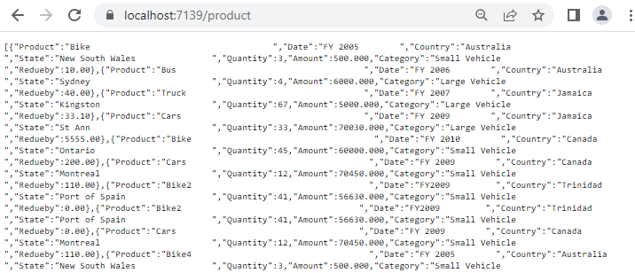

# Microsoft sql server in Vue Pivotview component

This section describes how to retrieve data from SQL Server database using [Microsoft SqlClient](https://learn.microsoft.com/en-us/dotnet/api/system.data.sqlclient?view=dotnet-plat-ext-7.0) and bind it to the Pivot Table via a Web API controller.

## Steps to connect the SQL Server database via Web API application

**1.** Download the ASP.NET Core Web Application from [this](https://github.com/SyncfusionExamples/how-to-bind-SQL-database-to-pivot-table) GitHub repository.

**2.** The application named as **PivotController** (server-side) that is downloaded from the above GitHub repository includes the following files.

* **PivotController.cs** file under **Controllers** folder – This helps to do data communication with Pivot Table.
* **Database1.mdf** file under **App_Data** folder – This MDF (Master Database File) file contains example data.

**3.** In the Web API controller (aka, PivotController), **SqlConnection** helps to connect the SQL database (that is, Database1.mdf). Next, using **SqlCommand** and **SqlDataAdapter** you can process the desired SQL query string and retrieve data from the database. The **Fill** method of the DataAdapter is used to populate the SQL data into a **DataTable** as shown in the following code snippet.

```
using Microsoft.AspNetCore.Mvc;
using System.Data;
using System.Data.SqlClient;

namespace PivotController.Controllers
{
    [ApiController]
    [Route("[controller]")]
    public class PivotController : ControllerBase
    {
        private static DataTable FetchSQLResult()
        {
            string conSTR = @"<Enter your valid connection string here>";
            string xquery = "SELECT * FROM table1";
            SqlConnection sqlConnection = new(conSTR);
            sqlConnection.Open();
            SqlCommand cmd = new(xquery, sqlConnection);
            SqlDataAdapter dataAdapter = new(cmd);
            DataTable dataTable = new();
            dataAdapter.Fill(dataTable);
            return dataTable;
        }
    }
}

```

**4.** In the **Get()** method of the **PivotController.cs** file, the **FetchSQLResult** method is used to retrieve the SQL data as a **DataTable**, which is then serialized into JSON using **JsonConvert.SerializeObject()**.

```
using Microsoft.AspNetCore.Mvc;
using Newtonsoft.Json;
using System.Data;
using System.Data.SqlClient;

namespace PivotController.Controllers
{
    [ApiController]
    [Route("[controller]")]
    public class PivotController : ControllerBase
    {
        [HttpGet(Name = "GetSQLResult")]
        public object Get()
        {
          return JsonConvert.SerializeObject(FetchSQLResult());
        }

        private static DataTable FetchSQLResult()
        {
            string conSTR = @"<Enter your valid connection string here>";
            string xquery = "SELECT * FROM table1";
            SqlConnection sqlConnection = new(conSTR);
            sqlConnection.Open();
            SqlCommand cmd = new(xquery, sqlConnection);
            SqlDataAdapter dataAdapter = new(cmd);
            DataTable dataTable = new();
            dataAdapter.Fill(dataTable);
            return dataTable;
        }
    }
}

```

**5.** Run the web application (aka, PivotController) and it will be hosted within the URL `https://localhost:7139`.

**6.** Finally, the retrieved data from SQL Server which is in the form of JSON can be found in the Web API controller available in the URL link `https://localhost:7139/pivot`, as shown in the browser page below.



## Connecting the Pivot Table to the hosted Web API URL

**1.** Download the vue Pivot Table sample from [this](https://github.com/SyncfusionExamples/how-to-bind-SQL-database-to-pivot-table) GitHub repository.

**2.** Next, map the hosted Web API's URL link `https://localhost:7139/pivot` to the Pivot Table component in **app.ts** by using the [url](https://ej2.syncfusion.com/vue/documentation/api/pivotview/dataSourceSettings/#url) property under [dataSourceSettings](https://ej2.syncfusion.com/vue/documentation/api/pivotview/dataSourceSettings/).

```ts
<script>
import Vue from "vue";
import {
  FieldList,
  PivotViewPlugin,
} from "@syncfusion/ej2-vue-pivotview";
Vue.use(PivotViewPlugin);
export default {
  data() {
    return {
      dataSourceSettings: {
        url: 'https://localhost:7139/pivot'
        //Other codes here...
      }
    };
  }
};
</script>
<style>
  //Syncfusion Angular controls styles
</style>

```

**3.** Frame and set the report based on the data retrieved from the SQL database.

```ts
<template>
  <div>
    <div class="control-section" style="overflow: auto">
      <div class="content-wrapper">
        <ejs-pivotview
          id="pivotview"
          ref="pivotview"
          :dataSourceSettings="dataSourceSettings"
          :showFieldList="showFieldList"
        ></ejs-pivotview>
      </div>
    </div>
  </div>
</template>
<script>
  import Vue from "vue";
  import {
    FieldList,
    PivotViewPlugin,
  } from "@syncfusion/ej2-vue-pivotview";
  Vue.use(PivotViewPlugin);
  export default {
    data() {
      return {
        dataSourceSettings: {
          url: 'https://localhost:7139/pivot',
          enableSorting: true,
          expandAll: false,
          columns: [{ name: 'Product' }],
          values: [{ name: 'Quantity' }, { name: 'Amount', caption: 'Sold Amount' }],
          rows: [{ name: 'Country' }, { name: 'State' }],
          formatSettings: [{ name: 'Amount', format: 'C0' }],
          filters: []
        },
        showFieldList: true
      };
    },
    methods: {
    },
    provide: {
      pivotview: [FieldList]
    }
  };
</script>
<style>
  @import "../node_modules/@syncfusion/ej2-base/styles/material.css";
  @import "../node_modules/@syncfusion/ej2-inputs/styles/material.css";
  @import "../node_modules/@syncfusion/ej2-buttons/styles/material.css";
  @import "../node_modules/@syncfusion/ej2-splitbuttons/styles/material.css";
  @import "../node_modules/@syncfusion/ej2-dropdowns/styles/material.css";
  @import "../node_modules/@syncfusion/ej2-lists/styles/material.css";
  @import "../node_modules/@syncfusion/ej2-popups/styles/material.css";
  @import "../node_modules/@syncfusion/ej2-popups/styles/material.css";
  @import "../node_modules/@syncfusion/ej2-navigations/styles/material.css";
  @import "../node_modules/@syncfusion/ej2-grids/styles/material.css";
  @import "../node_modules/@syncfusion/ej2-pivotview/styles/material.css";
</style>

```

**4.** Run the sample to get the following result.


> The sample for connecting the Pivot Table to a SQL Server database via an ASP.NET Web application can be found in [this](https://github.com/SyncfusionExamples/how-to-bind-SQL-database-to-pivot-table) GitHub repository.