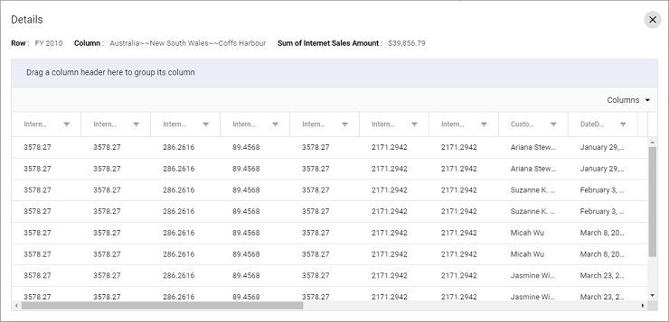

# Drill through in Vue Pivotview component

Allows to view the underlying raw data of a summarized cell in the pivot table. It can be enabled by setting the [`allowDrillThrough`](https://ej2.syncfusion.com/vue/documentation/api/pivotview/#allowdrillthrough) property to **true**. By double-clicking on any value cell, user can view the detailed raw data in a data grid inside a new window. In the new window, row header, column header and measure name of the clicked cell will be shown at the top. Also, user can include or exclude fields available in the data grid using column chooser option.

To use the drill through feature, inject the `DrillThrough` module in the pivot table.






        


Users can also view the underlying raw data though the pivot chart. By clicking on any data point, user can view the detailed raw data in a data grid inside a new window.






        


## Maximum rows to retrieve

> This property is applicable only for the OLAP data source.

The [`maxRowsInDrillThrough`](https://ej2.syncfusion.com/vue/documentation/api/pivotview/#maxrowsindrillthrough) property allows to specify the maximum number of rows that should be returned while drill through. By default, this property is set to **"10000"**. This means that if you do not specify this property, you will get 10,000 rows or less.

```
<template>
    <div id="app">
        <ejs-pivotview :dataSourceSettings="dataSourceSettings" :height="height" :showFieldList="showFieldList" :allowDrillThrough="allowDrillThrough" :maxRowsInDrillThrough="maxRowsInDrillThrough"> </ejs-pivotview>
    </div>
</template>

<script>
import Vue from "vue";
import { PivotViewPlugin, FieldList } from "@syncfusion/ej2-vue-pivotview";

Vue.use(PivotViewPlugin);

export default {
  data () {
    return {
      dataSourceSettings: {
            catalog: 'Adventure Works DW 2008 SE',
            cube: 'Adventure Works',
            providerType: 'SSAS',
            enableSorting: true,
            url: 'https://bi.syncfusion.com/olap/msmdpump.dll',
            localeIdentifier: 1033,
            rows: [
                { name: '[Customer].[Customer Geography]', caption: 'Customer Geography' },
            ],
            columns: [
                { name: '[Product].[Product Categories]', caption: 'Product Categories' },
                { name: '[Measures]', caption: 'Measures' },
            ],
            values: [
                { name: '[Measures].[Customer Count]', caption: 'Customer Count' },
                { name: '[Measures].[Internet Sales Amount]', caption: 'Internet Sales Amount' },
                { name: 'Order on Discount', isCalculatedField: true }
            ],
            filters: [
                { name: '[Date].[Fiscal]', caption: 'Date Fiscal' },
            ],
            calculatedFieldSettings: [
                {
                    name: 'BikeAndComponents',
                    formula: '([Product].[Product Categories].[Category].[Bikes] + [Product].[Product Categories].[Category].[Components] )',
                    hierarchyUniqueName: '[Product].[Product Categories]',
                    formatString: 'Standard'
                },
                {
                    name: 'Order on Discount',
                    formula: '[Measures].[Order Quantity] + ([Measures].[Order Quantity] * 0.10)',
                    formatString: 'Currency'
                }
            ],
            filterSettings: [
                {
                    name: '[Date].[Fiscal]', items: ['[Date].[Fiscal].[Fiscal Quarter].&[2002]&[4]',
                        '[Date].[Fiscal].[Fiscal Year].&[2005]'],
                    levelCount: 3
                }
            ]
      },
      allowDrillThrough: true,
      maxRowsInDrillThrough: 10,
      showFieldList: true,
      height: 350
    }
  },
  provide: {
    pivotview: [FieldList]
  }
}
</script>
<style>
@import "@syncfusion/ej2-vue-pivotview/styles/material.css";
</style>
```



## Events

### DrillThrough

The event [`drillThrough`](https://ej2.syncfusion.com/vue/documentation/api/pivotview/#drillthrough) triggers every time before a value cell is double clicked. This event allows user to customize the data grid columns in drill through popup. Exclusively the event helps to view and process the raw data information behind a aggregated value inside value cell. It has the following parameters:

* `columnHeaders` - It holds column header of the current cell.
* `currentCell` - It holds the current cell's information.
* `currentTarget` - It holds current cell's html element.
* `gridColumns` - It holds data grid columns to be rendered in drill through popup.
* `rawData` - It holds current cell's raw data.
* `rowHeaders` - It holds row header of current cell.
* `value` - It holds value of current cell.
* `cancel` - It is a boolean property and by setting this to true, dialog won’t be created.






        


### BeginDrillThrough

The event [`beginDrillThrough`](https://ej2.syncfusion.com/vue/documentation/api/pivotview/#begindrillthrough) occurs for each and every value cell with a double click, and the event argument provides the data grid information before the drill-through popup is shown. User can access the data grid (which holds the raw data underneath the aggregated value cell) options such as sort, group, filter and customize those in the data grid. It has the following parameters:

* `gridObj` - It holds the data grid instance to be rendered inside the drill-through popup.
* `cellInfo` - It holds current cell information like raw data, row header, column header and value.

> Grid features are segregated into individual feature-wise modules. For example, to use sorting feature, you should inject `Sort` using the `Grid.Inject(Sort)` section.






        
