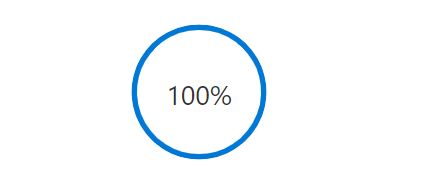

# Getting Started with Syncfusion Progress Bar component in Vue 3

This section explains how to use Progress Bar component in Vue 3 application.

## Prerequisites

[System requirements for Syncfusion Vue UI components](https://ej2.syncfusion.com/vue/documentation/system-requirements/)

## Creating Vue application using Vue CLI

The easiest way to create a Vue application is to use the [`Vue CLI`](https://github.com/vuejs/vue-cli). Vue CLI versions above [`4.5.0`](https://v3.vuejs.org/guide/migration/introduction.html#vue-cli) are mandatory for creating applications using Vue 3. Use the following command to uninstall older versions of the Vue CLI.

```bash
npm uninstall vue-cli -g
```

Use the following commands to install the latest version of Vue CLI.

```bash
npm install -g @vue/cli
npm install -g @vue/cli-init
```

Create a new project using the command below.

```bash
vue create quickstart
```

Initiating a new project prompts us to choose the type of project to be used for the current application. Select the option `Default (Vue 3)` from the menu.


## Adding Syncfusion Progress Bar package in the application

Syncfusion Vue packages are maintained in the [`npmjs.com`](https://www.npmjs.com/~syncfusionorg) registry. The Progress Bar component will be used in this example. To install it in the **quickstart** folder use the following command.

```bash
npm install @syncfusion/ej2-vue-progressbar --save
```

## Adding Syncfusion Progress Bar component in the application

You have completed all the necessary configurations needed for rendering the Syncfusion Vue component. Now, you are going to add the Progress Bar component using following steps.

1. Import the Progress Bar component in the `<script>` section of the `src/App.vue` file.

    ```
    <script>
    import { ProgressBarComponent } from "@syncfusion/ej2-vue-progressbar";
    </script>
    ```

2. Register the Progress Bar component which is used in this example. Find the list of child directives and tag names that can be used in the Progress Bar component in the following table.

    | Directive Name   | Tag Name    |
    |------------------|-------------|
    | `ProgressBarAnnotationsDirective` | `e-progressbar-annotations` |
    | `ProgressBarAnnotationDirective`  | `e-progressbar-annotation`  |

    ```js
    import { ProgressBarComponent } from "@syncfusion/ej2-vue-progressbar";

    //Component registration.
    export default {
      name: "App",
      components: {
        "ejs-progressbar": ProgressBarComponent
      }
    };
    ```

3. Add the Progress Bar component definition in template section.

    ```
    <template>
      <ejs-progressbar id="percentage" :type='type' :showProgressValue='showProgressValue' :value='value' :animation="animation"></ejs-progressbar>
    </template>
    ```

    Above is the Progress Bar component definition with [`type`](https://ej2.syncfusion.com/vue/documentation/api/progressbar/#type), [`value`](https://ej2.syncfusion.com/vue/documentation/api/progressbar/#value), [`showProgressValue`](https://ej2.syncfusion.com/vue/documentation/api/progressbar/#showprogressvalue) and [`animation`](https://ej2.syncfusion.com/vue/documentation/api/progressbar/#animation) properties.

4. Declare the bound properties in the `script` section.

    ```js
    export default {
      name: "App",
      components: {
        "ejs-progressbar": ProgressBarComponent
      },
      data() {
        return {
          type: 'Circular',
          showProgressValue: 'true',
          value: 100,
          animation: {
            enable: true,
            duration: 2000,
            delay: 0
          }
        };
      },
    };
    ```

5. Summarizing the above steps, update the `src/App.vue` file with following code.

    ```
    <template>
      <ejs-progressbar id="percentage" :type='type' :showProgressValue='showProgressValue' :value='value' :animation="animation">
      </ejs-progressbar>
    </template>

    <script>
    import { ProgressBarComponent } from "@syncfusion/ej2-vue-progressbar";

    export default {
      name: "App",
      components: {
        "ejs-progressbar": ProgressBarComponent
      },
      data() {
        return {
          type: 'Circular',
          showProgressValue: 'true',
          value: 100,
          animation: {
            enable: true,
            duration: 2000,
            delay: 0
          }
        };
      },
    };
    </script>
    ```

6. Run the application using the following command.

    ```bash
    npm run serve
    ```

The web server will be initiated and open the **quickstart** app in the browser at port [`localhost:8080`](http://localhost:8080/).



Refer the following sample, [vue3-progressbar-getting-started](https://github.com/SyncfusionExamples/vue3-progressbar-getting-started).