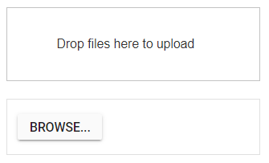
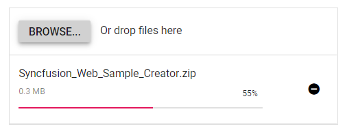
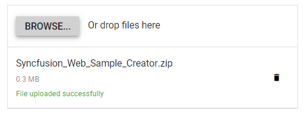

# Getting Started

This section explains how to use Syncfusion Vue Uploader components in Vue 3 application.

## Prerequisites

[System requirements for Syncfusion Vue UI components](https://ej2.syncfusion.com/vue/documentation/system-requirements/)

## Creating Vue application using Vue CLI

The easiest way to create a Vue application is to use the [`Vue CLI`](https://github.com/vuejs/vue-cli). Vue CLI versions above [`4.5.0`](https://v3.vuejs.org/guide/migration/introduction.html#vue-cli) are mandatory for creating applications using Vue 3. Use the following command to uninstall older versions of the Vue CLI.

```bash
npm uninstall vue-cli -g
```

Use the following commands to install the latest version of Vue CLI.

```bash
npm install -g @vue/cli
npm install -g @vue/cli-init
```

Create a new project using the command below.

```bash
vue create quickstart
```

Initiating a new project prompts us to choose the type of project to be used for the current application. Select the option `Default (Vue 3)` from the menu.


## Adding Syncfusion Uploader package in the application

 Syncfusion Vue packages are maintained in the [`npmjs.com`](https://www.npmjs.com/~syncfusionorg) registry. The Uploader component will be used in this example. To install it use the following command.

```bash
npm install @syncfusion/ej2-vue-inputs --save
```

## Adding CSS reference for Syncfusion Vue Uploader component

Import the needed css styles for the Uploader component along with dependency styles in the `<style>` section of the `src/App.vue` file as follows.

```
<style>
    @import "../node_modules/@syncfusion/ej2-base/styles/material.css";
    @import "../node_modules/@syncfusion/ej2-buttons/styles/material.css";
    @import "../node_modules/@syncfusion/ej2-vue-inputs/styles/material.css";
</style>
```

## Adding Syncfusion Vue Uploader component in the application

You have completed all the necessary configurations needed for rendering the Syncfusion Vue component. Now, you are going to add the Uploader component using following steps.

Import the Uploader component in the `<script>` section of the `src/App.vue` file.

```
<script>
import { UploaderComponent } from "@syncfusion/ej2-vue-inputs";
</script>
```

Register the Uploader component.

 ```js
import { UploaderComponent } from "@syncfusion/ej2-vue-inputs";
//Component registeration
export default {
    name: "App",
    components: {
        'ejs-uploader' : UploaderComponent,
    }
}
```

Add the component definition in template section.

```
<template>
  <div>
    <div id="modalTarget" class="control-section; position:relative" style="height:350px;">
        <ejs-uploader ref="uploadObj" id='defaultfileupload' name="UploadFiles"></ejs-uploader>
    </div>
  </div>
</template>
```

Summarizing the above steps, update the `src/App.vue` file with following code.

```
<template>
  <div>
    <div id="modalTarget" class="control-section; position:relative" style="height:350px;">
        <ejs-uploader ref="uploadObj" id='defaultfileupload' name="UploadFiles"></ejs-uploader>
    </div>
  </div>
</template>
<script>
import { UploaderComponent } from "@syncfusion/ej2-vue-inputs";
//Component registeration
export default {
    name: "App",
    components: {
        'ejs-uploader': UploaderComponent,
    },
    data: function() {
        return {  }
    }
}
</script>
<style>
    @import "../node_modules/@syncfusion/ej2-base/styles/material.css";
    @import "../node_modules/@syncfusion/ej2-buttons/styles/material.css";
    @import "../node_modules/@syncfusion/ej2-vue-inputs/styles/material.css";
    #app {
        color: #008cff;
        height: 40px;
        left: 45%;
        position: absolute;
        top: 45%;
        width: 20%;
    }
    .control-section {
        height: 100%;
        min-height: 200px;
    }
</style>
```

## Running the application

Run the application using the following command.

```bash
npm run serve
```

Output be like the below.


## Adding drop area

By default, the uploader component allows to upload files by drag the files from file explorer, and drop into the drop area.  You can configure any other external element as drop target using dropArea property.

In the following sample, drop target is configured.

```
<template>
  <div>
    <div id='droparea'>Drop files here to upload</div>
    <ejs-uploader ref="uploadObj" id='defaultfileupload' name="UploadFiles"  :dropArea = "dropElement"></ejs-uploader>
  </div>
</template>
<script>
import { UploaderComponent } from "@syncfusion/ej2-vue-inputs";
//Component registeration
export default {
    name: "App",
    components: {
        'ejs-uploader' : UploaderComponent,
    },
    data: function() {
        return {
            dropElement: '#droparea'
        }
    }
}
</script>
<style>
    @import "../node_modules/@syncfusion/ej2-base/styles/material.css";
    @import "../node_modules/@syncfusion/ej2-buttons/styles/material.css";
    @import "../node_modules/@syncfusion/ej2-vue-inputs/styles/material.css";
    #container {
        visibility: hidden;
        padding-left: 5%;
        width: 100%;
    }
    #loader {
        color: #008cff;
        font-family: 'Helvetica Neue','calibiri';
        font-size: 14px;
        height: 40px;
        left: 45%;
        position: absolute;
        top: 45%;
        width: 30%;
    }
    .fileupload {
        margin: 20px auto;
        width: 400px;
    }
    #droparea {
        padding: 50px 25px;
        margin: 30px auto;
        border: 1px solid #c3c3c3;
        text-align: center;
        width: 20%;
        display: inline-flex;
    }
    .e-file-select,
    .e-file-drop {
        display: none;
    }
    body .e-upload-drag-hover {
         outline: 2px dashed brown;
    }
    #uploadfile {
        width: 60%;
        display: inline-flex;
        margin-left: 5%;
    }
</style>
```

Output be like the below.



## Configure asynchronous settings

The uploader component process the files to upload in Asynchronous mode by default. Define the properties [saveUrl](https://ej2.syncfusion.com/vue/documentation/api/uploader/asyncSettings/#saveurl) and [removeUrl](https://ej2.syncfusion.com/vue/documentation/api/uploader/asyncSettings/#removeurl) to handle the save and remove action as follows.

```
<template>
  <div>
    <ejs-uploader ref="uploadObj" id='defaultfileupload' name="UploadFiles" :asyncSettings= "path" ></ejs-uploader>
  </div>
</template>
<script>
import { UploaderComponent } from "@syncfusion/ej2-vue-inputs";
//Component registeration
export default {
    name: "App",
    components: {
        'ejs-uploader': UploaderComponent,
    },
    data: function() {
        return {
            path: {
                saveUrl: 'https://ej2.syncfusion.com/services/api/uploadbox/Save',
                removeUrl: 'https://ej2.syncfusion.com/services/api/uploadbox/Remove'
            }
        }
    }
}
</script>
<style>
    @import "../node_modules/@syncfusion/ej2-base/styles/material.css";
    @import "../node_modules/@syncfusion/ej2-buttons/styles/material.css";
    @import "../node_modules/@syncfusion/ej2-vue-inputs/styles/material.css";
</style>
```

Output be like the below.



## Handle success and failed upload

You can handle the success and failure actions using the [success](https://ej2.syncfusion.com/vue/documentation/api/uploader/#success) and [failure](https://ej2.syncfusion.com/vue/documentation/api/uploader/#failure) &nbsp;events. To handle these event, define the function and assign it to corresponding event as follows.

```
<template>
  <div>
    <ejs-uploader ref="uploadObj" id='defaultfileupload' name="UploadFiles" :asyncSettings= "path" :success= "onUploadSuccess" :failure= "onUploadFailed" ></ejs-uploader>
  </div>
</template>
<script>
import { UploaderComponent } from "@syncfusion/ej2-vue-inputs";
//Component registeration
export default {
    name: "App",
    components: {
        'ejs-uploader' : UploaderComponent,
    },
    data: function() {
        return {
            path:  {
                saveUrl: 'https://ej2.syncfusion.com/services/api/uploadbox/Save',
                removeUrl: 'https://ej2.syncfusion.com/services/api/uploadbox/Remove'
            }
        }
    },
    methods: {
        onUploadSuccess: function () {
            console.log('Uploaded successfully');
        },
        onUploadFailed: function () {
            console.log('Upload fails');
        }
    }
}
</script>
<style>
    @import "../node_modules/@syncfusion/ej2-base/styles/material.css";
    @import "../node_modules/@syncfusion/ej2-buttons/styles/material.css";
    @import "../node_modules/@syncfusion/ej2-vue-inputs/styles/material.css";
</style>
```

Output be like the below.



## See Also

* [How to add additional data on upload](./how-to/add-additional-data-on-upload)
* [Achieve file upload programmatically](./how-to/achieve-file-upload-programmatically)
* [Achieve invisible upload](./how-to/achieve-invisible-upload)
